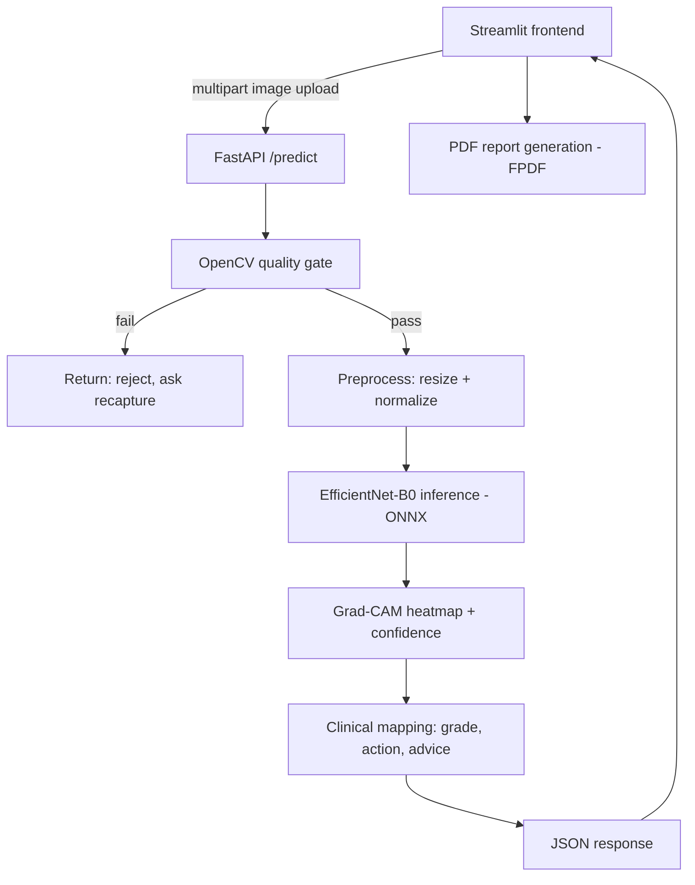
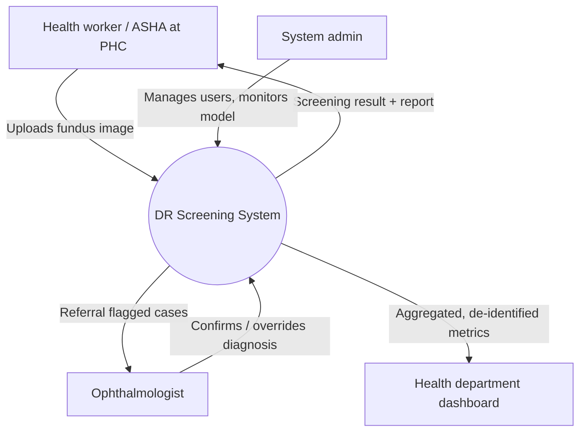
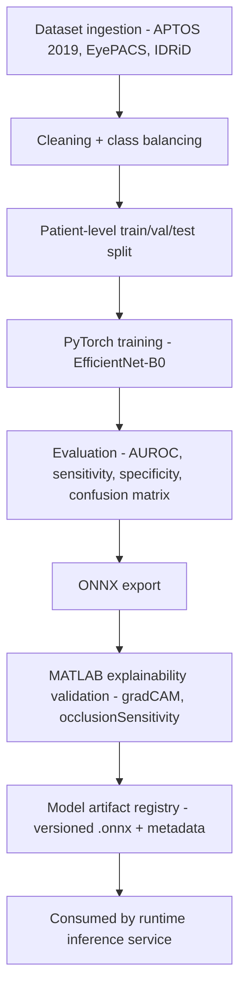

## 1. Full Technology Stack

| Layer | Technology | Purpose | MVP | Production |
|---|---|---|---|---|
| Frontend (field use) | Streamlit | Rapid UI for upload, form, results | ✅ | Replace with React/mobile app |
| Frontend (clinical dashboard) | React + shadcn/ui | Ophthalmologist review, case history | ❌ | ✅ |
| Backend API | FastAPI | HTTP inference service, JSON contracts | ✅ | ✅ (multi-replica) |
| API server | Uvicorn / Gunicorn | Runs the ASGI app | ✅ | ✅ |
| Deep learning framework | PyTorch | Model training | ✅ | ✅ |
| Model architecture | EfficientNet-B0 (timm) | DR classification (5 classes) | ✅ | ✅ (+ ensemble option) |
| Explainability (sponsor-aligned) | MATLAB Deep Learning Toolbox (`gradCAM`, `occlusionSensitivity`) | Satisfies MathWorks' MATLAB-based pipeline requirement | ✅ | ✅ |
| Explainability (runtime) | `pytorch-grad-cam` | Fast in-app heatmap generation | ✅ | ✅ |
| Model interchange | ONNX / ONNX Runtime | Portable, framework-agnostic serving | ✅ | ✅ (+ TensorRT for GPU speed) |
| Image processing | OpenCV, Pillow, NumPy | Quality gating, preprocessing, visualization | ✅ | ✅ |
| Preprocessing | Albumentations | Resize, normalize, augmentation | ✅ | ✅ |
| Reporting | FPDF2 | PDF screening reports | ✅ | ✅ (+ templated multilingual reports) |
| Async processing | Celery + Redis | Queue inference jobs, avoid blocking | ❌ | ✅ |
| Database | PostgreSQL | Patients, screenings, audit logs | ❌ | ✅ |
| Object storage | AWS S3 / MinIO | Store images, heatmaps, PDF reports | ❌ | ✅ |
| Authentication | OAuth2 / JWT (FastAPI Security) | Role-based access for health workers, doctors, admins | ❌ | ✅ |
| Model registry / MLOps | MLflow | Model versioning, experiment tracking, rollback | ❌ | ✅ |
| Containerization | Docker + Docker Compose | Reproducible local/dev environment | ✅ | ✅ |
| Orchestration | Kubernetes | Auto-scaling, multi-replica production deployment | ❌ | ✅ |
| CI/CD | GitHub Actions | Automated testing, linting, deployment | ❌ | ✅ |
| Monitoring | Prometheus + Grafana | Latency, error rate, model drift dashboards | ❌ | ✅ |
| Logging | structlog / ELK stack | Structured, searchable logs | ❌ | ✅ |
| Deployment (demo) | Render / Railway / Hugging Face Spaces | Fast public demo link for judges | ✅ | Replaced by cloud (AWS/GCP/Azure) |
| Deployment (production) | AWS/GCP/Azure + Kubernetes | Scalable, secure, HIPAA/DPDP-aligned hosting | ❌ | ✅ |

---

## 2. MVP Architecture — Hackathon Scope (36–48 hrs)

Goal: a working, demoable, explainable pipeline. No auth, no database, no scaling concerns — just correctness, explainability, and a live demo link.

**MVP scope table**

| Component | In MVP? | Notes |
|---|---|---|
| Image upload + patient form | Yes | Streamlit sidebar form |
| Image quality gate | Yes | OpenCV blur/exposure/region check |
| DR classification | Yes | EfficientNet-B0, 5 classes |
| Confidence score / review flag | Yes | Threshold on softmax max prob |
| Grad-CAM explainability | Yes | Already implemented |
| MATLAB explainability validation | Yes | Offline notebook, screenshots in pitch deck |
| PDF report | Yes | Patient info, image, heatmap, recommendation |
| Auth / user accounts | No | Deferred to production |
| Database / case history | No | Deferred to production |
| Multi-user / multi-tenant | No | Deferred to production |

---

## 3. System Context Diagram

---

## 4. Offline Training & Validation Pipeline

---

